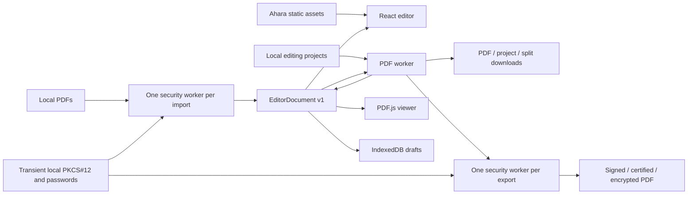

# Architecture

## Runtime boundary

PDFree is a React/TypeScript application built with Vite. Ahara delivers public
application assets at `pdf.ahara.io`; user-selected PDFs, edits, signature images
and signing credentials are processed on the device. Application runtime state
has no server component. Rendering uses PDF.js, writing uses pdf-lib, project ZIP
handling uses fflate, and project validation uses Zod.

The network boundary is defined in [ADR 0001](adr/0001-browser-only-static-delivery.md).
Application asset caching and updates are described in
[ADR 0004](adr/0004-projects-drafts-and-retained-pwa.md).

## Editing model and coordinates

[`model.ts`](../frontend/src/core/model.ts) defines `EditorDocument.version = 1`:

| Member                 | Contract                                                                                                                    |
| ---------------------- | --------------------------------------------------------------------------------------------------------------------------- |
| `sources`              | Stable IDs, immutable original PDF bytes, nullable decrypted working bytes/encryption metadata, derived fields and warnings |
| `pages`                | Stable page IDs, source ID/index, quarter-turn rotation, visible page box and placed objects                                |
| `values`               | Native values keyed by source ID and field name, distinct from displayed choice labels                                      |
| `assets`               | Stable asset IDs and local PNG/JPEG bytes referenced by placed objects                                                      |
| `name`                 | Validated output/project name                                                                                               |
| `allowDecryptedDrafts` | Explicit consent to store unprotected working content in local drafts; defaults false                                       |

Page identities survive reorder; source indices address original pages. Blank
pages use an empty source reference. Added content uses PDF page coordinates;
`coordinates.ts` and `widgetGeometry.ts` translate viewport, crop offset and
rotation. `visiblePage.ts` derives the CropBox/MediaBox intersection, with MediaBox
fallback for an empty intersection. Source PDF page boxes remain intact.

`history.ts`, editor operations and React hooks consume this same model. UI
selection and transient dialog state sit outside it. Document replacement resets
clipboard/selection state so assets from another document cannot leak into edits.
Opening and export credentials use separate transient types, never `EditorDocument`.
See [ADR 0002](adr/0002-one-model-immutable-sources.md).

## Import and rendering

`securityClient.ts` runs each PDF import in a dedicated worker with cancellation
and typed password/recipient retry errors. `unlockPdf.ts` authenticates Standard
password handlers or resolves Adobe.PubSec CMS recipient envelopes before object
streams are read. It creates unprotected working bytes while preserving the
original ciphertext. `sourceBytes()` selects the working copy for viewers/writers.
Passwords and identity files do not become document state.

`importPdf.ts` parses working sources and rejects unsupported handlers, XFA, existing
certificate signatures, nonstandard page units and unsupported controls before
editing. It derives field/widget relationships and reports scripted-field and
catalog-composition warnings. `nativeFields.ts` and choice helpers preserve
labels, export values, flags and repeated widgets.

PDF.js renders original page backgrounds with native fields and added objects
overlaid by the editor. Text selection/search use the original text layer plus
entered text. Page and thumbnail windows bound mounted canvases; raster budgets
bound allocations. Viewers, canvases and temporary object URLs are released as
documents change. [Compatibility](compatibility.md) defines the limits.

## Ordinary PDF and split export

`pdfWorker.ts` accepts typed requests for PDF export, project save/open,
image-page conversion and split export. `workerClient.ts` matches request IDs and
reports startup, transfer or worker failures to the UI.

`exportPdf.ts` selects one of two paths:

- **Preserve:** all pages of one original source, each exactly once. Load its
  bytes, reorder pages, apply rotation/values and remove the catalog OpenAction.
- **Compose:** graft selected pages into a new PDF with `copyForms.ts`.
  Namespace field names across sources, preserve field/widget relationships,
  map edited values and remove orphan widgets. Referenced sources with structures
  that cannot safely be remapped fail explicitly.

Both paths embed bundled fonts, validate text, add authored fields and draw
objects. Native appearances are regenerated. Flattening captures widget
references before pdf-lib removes dictionaries, then removes only those widget
references from page annotations; ordinary comments remain.

Split preview and output use current physical page membership and stable page
IDs. `exportBatch.ts` processes one split request with reusable parsed sources
and assembles the ZIP in the worker. It does not parse each source anew for each
composed output. PDF pages remain text/vector/image content rather than whole-page
screenshots. See [ADR 0003](adr/0003-pdf-engines-and-preservation.md).

## Secured export

The ordinary writer finishes its PDF first. `useExportPdf.ts` establishes
cancellation before credential/font/PDF preparation. `securityClient.ts` then
transfers export bytes and certificate bytes into one dedicated security worker.
That worker terminates after success, failure or cancellation, including transfer
failures. Closing the dialog aborts the operation and prevents a later download.

`securePdf.ts` validates settings and the local identity, creates a signature
placeholder, applies optional AES-256 protection, calculates final byte ranges,
creates detached CMS and inserts it without rewriting covered bytes. LibPDF 0.5.2
handles password protection and signing identity decoding; node-forge 1.4.0
decodes recipient identities and legacy CMS ciphers. `recipientProtection.ts`
builds AES-256 Adobe.PubSec output; `publicKeyPdf.ts`, `recipientKey.ts`,
`recipientEnvelope.ts` and `recipientCipher.ts` authenticate/decrypt incoming
recipient envelopes. PKIjs 3.4.1, ASN1js 3.0.10 and Web Crypto handle
certificate/CMS operations. Encryption precedes signing.

Maintained pnpm patches in `frontend/patches/` fix LibPDF authentication order,
legacy password encoding, strict cipher validation and crypt-filter handling,
and expose explicit public-key cipher hooks. The PKIjs patch corrects the default
RSA-OAEP label and omission of absent ECDH shared-info fields. Independent native
fixtures exercise these corrections. See [ADR 0007](adr/0007-encrypted-document-lifecycle.md).

`signaturePlaceholder.ts` reuses the first empty signature field, rejecting
unsupported seed/lock requirements, or creates an invisible one when none exists.
Generated/widgetless fields combine field and widget
entries, link to the first page and use a zero-size rectangle; existing visible
widgets retain their structure and geometry. Certification adds DocMDP and, for
policy 1, a field lock. [Security](security.md) defines reader semantics and
credential boundaries; [ADR 0005](adr/0005-secured-export-pipeline.md) records rationale.

## Durable projects and local recovery

The `.pdfree` format is a ZIP with `manifest.json`, `sources/<index>.pdf` and
`assets/<index>.png` or `.jpg`. Plain documents retain manifest version 1;
encrypted documents use manifest version 2 with additional `working/<index>.pdf`
entries and encryption metadata. Both decode to editing model version 1. Original
ciphertext remains in `sources/`; working entries are unprotected and contain no
opening credentials. Project save requires explicit confirmation for these documents.
`projects.ts` uses source/asset path descriptors replacing raw bytes. The manifest retains pages,
objects, values and stable IDs; field descriptors are rederived from source PDFs.
`projectSchema.ts`, `projectReferences.ts` and `projectLimits.ts` validate shape,
geometry, unique identities, references and archive budgets on save/open.
Unknown project versions fail explicitly. See [ADR 0004](adr/0004-projects-drafts-and-retained-pwa.md).

IndexedDB stores local library documents under `pdfree-draft-v2:` with write revisions,
model revision 3 and generation tokens. Opening a replacement creates a separate
entry; reopening a saved document updates its existing entry. Each tab remembers
its active entry for reload recovery. Concurrent saves of the same entry retain
both working copies by assigning a new ID to the conflicting writer.
Legacy drafts refresh derived
source descriptors while retaining edits; revision-2 drafts normalize new nullable
source properties without changing geometry. Encrypted-source drafts default off
and require document-level consent. Generation and current consent checks share a
transaction: stale queued writes cannot resurrect deleted entries. Deleting one
entry increments its generation and leaves other entries untouched. BroadcastChannel
and local events notify open tabs of deletion; matching open documents remain in
memory and resume autosaving after the next edit. Remembered signature changes are atomic
IndexedDB updates. Browser storage remains evictable; portable projects provide
the explicit backup path.

## Source ownership

| Area              | Authoritative sources                                                                                                                        |
| ----------------- | -------------------------------------------------------------------------------------------------------------------------------------------- |
| Model/operations  | `frontend/src/core/model.ts`, `history.ts`, `editorOperations.ts`, `pageOperations.ts`                                                       |
| PDF writer/import | `frontend/src/core/importPdf.ts`, `exportPdf.ts`, `copyForms.ts`, `nativeFields.ts`                                                          |
| Security          | `frontend/src/core/securePdf.ts`, `signaturePlaceholder.ts`, `signatureCms.ts`, `protectPdf.ts`                                              |
| Encrypted input   | `frontend/src/core/unlockPdf.ts`, `publicKeyPdf.ts`, `recipientIdentity.ts`, `recipientEnvelope.ts`, `recipientCipher.ts`, `recipientKey.ts` |
| Persistence       | `frontend/src/core/projects.ts`, `projectSchema.ts`; `frontend/src/services/drafts.ts`, `signatures.ts`                                      |
| UI/orchestration  | `frontend/src/components/`, `frontend/src/hooks/`                                                                                            |
| Worker protocols  | `frontend/src/services/pdfWorker.ts`, `workerClient.ts`, `securityWorker.ts`, `securityClient.ts`                                            |
| Hosting contract  | `frontend/security-headers.json`, `infrastructure/terraform/`, `platform.yml`, `.github/workflows/ci.yml`                                    |

Deployment ownership and configuration are in [deployment](deployment.md).
